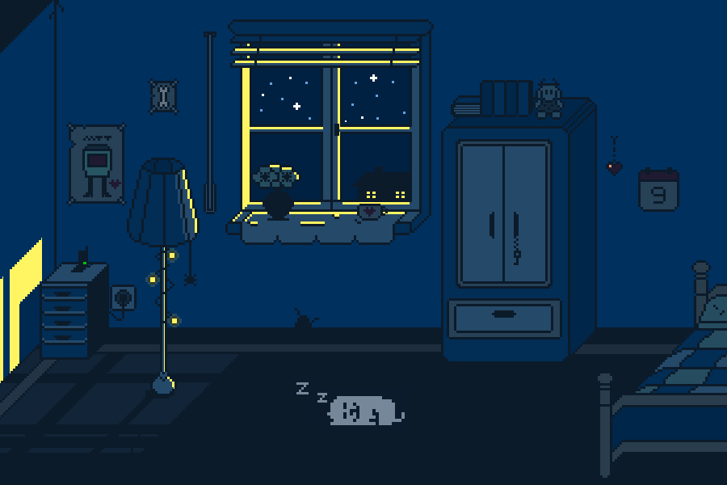

<table>
<tr>
<td width="65%" style="padding-right: 30px; vertical-align: top; font-size: 16px; line-height: 1.8;">

<h2>🚀 About Me</h2>

- 🎓 Systems Engineering student  
- 💻 Backend developer passionate about scalable systems  
- 🔐 Cybersecurity enthusiast  
- 🧠 Constant learner  

</td>

<td width="35%" align="center">

</td>
</tr>
</table>

## 🛠️ Tech Stack

### 👨‍💻 Languages

---

### 🌐 Frontend

---

### ⚙️ Tools & Technologies

---

  ## 📊 GitHub Stats

  

  

   

  

---

## 📫 Contact Me

